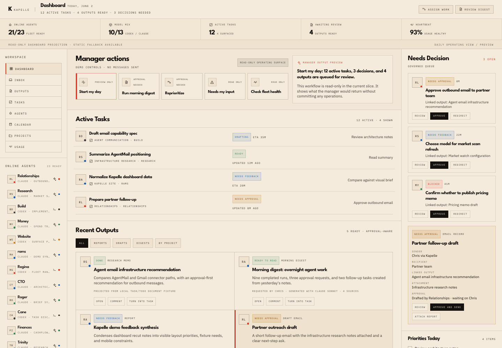
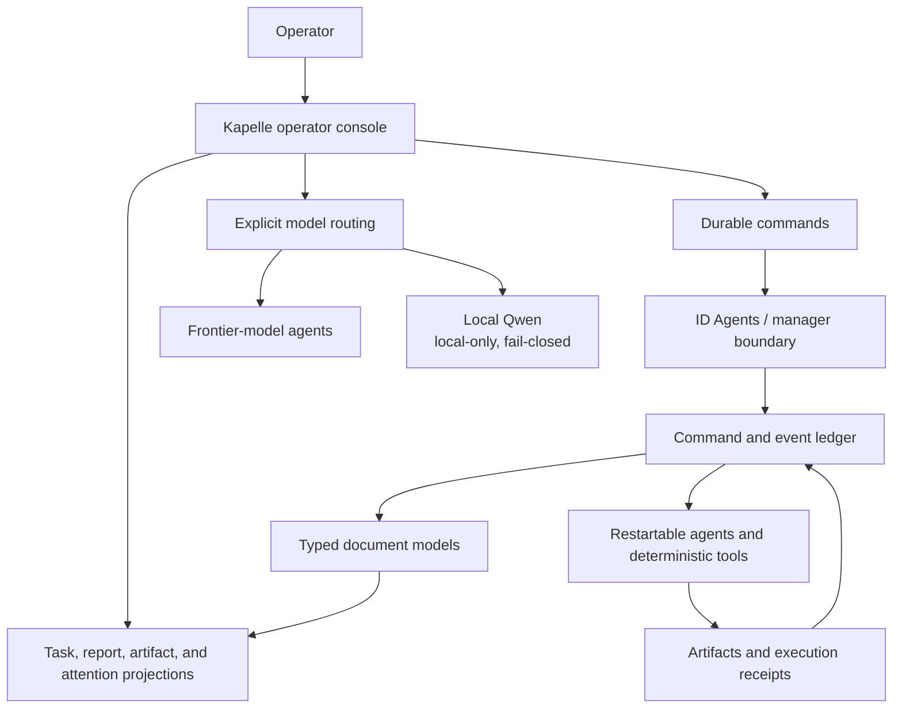

# Kapelle

**Your agents need a home base.**

A local-first operating console for coordinating AI agents, reviewing their work, and turning output into durable tasks, reports, dispatches, and approvals.

**Start here:** [Current status](docs/status.md) · [Workflows](docs/workflows.md) · [Document models](docs/document-models.md) · [Agent guide](AGENTS.md)

Website: [Kapelle.ai](https://kapelle.ai) · [Conference brief](docs/conference-brief.md)

## Choose your route

- **Understand:** read the workflows and current status, then explore the architecture.
- **Explore:** follow the [contract index](docs/contracts.md) and [orchestration boundary](docs/id-agents-boundary.md).
- **Run:** use the five-minute commands below, including the connected synthetic walkthrough.

**October 5, 2026:** the private prototype has inbox, task and report workflows and bounded review agents. Native References/Collections are awaiting activation; general Task-to-agent delegation is next. This repository is an MIT-licensed reference implementation, not the complete deployable product.

Kapelle grew out of a practical problem: once several agents are working across real projects, chat stops being an adequate control surface. The operator needs to know what is running, what landed, what requires a decision, and what actually changed.



> The image above is captured from the working Kapelle UI using deterministic synthetic fixtures. It contains no private fleet data. The private deployment, records, credentials, and machine configuration are deliberately not published.

This repository is the public, executable architecture of that system. It is not a placeholder landing page and it is not a dump of the private product repository. It contains the parts that can be evaluated safely: protocol contracts, operation-sourced document models, a restart-safe command store, synthetic lifecycle fixtures, a fail-closed local-inference boundary, tests, and the product architecture behind the working UI.

## What has been built

| Capability | Public evidence |
|---|---|
| **Operator UI** for agent output, tasks, reports, review, comments, and approvals | Sanitized capture above and the [operator-experience contract](docs/operator-experience.md) |
| **ID Agents integration boundary** for named agents, teams, dispatch, and receipts | [Boundary document](docs/id-agents-boundary.md) and [versioned protocol](packages/protocol/src/index.js) |
| **Durable operational ledger** based on Powerhouse-inspired document models | Executable [Task and Dispatch Journal reducers](packages/document-models/src/index.js), [fixture](fixtures/dispatch-lifecycle.json), and [tests](tests/reference.test.js) |
| **Restart-safe control plane** with idempotent command acceptance | Runnable [reference API](apps/reference-control-plane/src/server.js) and durable [command store](apps/reference-control-plane/src/store.js) |
| **Local AI beside frontier-model agents** | Fail-closed [local-inference package](packages/local-inference/src/index.js), [tests](tests/local-inference.test.js), and [design notes](docs/local-ai.md) |

The working private system is larger than this repository. Public claims here are intentionally limited to behavior demonstrated by code, synthetic fixtures, tests, or clearly labeled UI evidence.

## Documents carry the work

A **Reference** retains a source. A **Collection** groups References and Reports. A **Report** presents authored findings. A **Task** records a commitment, while a **Dispatch** records agent work. Agent identities, reviewed versions and explicit relationships connect them across conversations and runtimes.

The public code implements simplified Task/Dispatch examples. The [model map](docs/document-models.md) explains the wider private architecture without claiming all models are public or deployed.

## Local AI: Qwen on Apple silicon

Kapelle can route bounded advisory work to `mlx-community/Qwen3.6-27B-4bit`, running locally on an M4 Mac mini through an OpenAI-compatible loopback endpoint. This sits beside frontier-model agents rather than replacing them.

The public boundary is deliberately narrow:

- requests must declare `policy: "local-only"` and an admitted purpose;
- the endpoint must be explicit numeric loopback HTTP with an exact `/v1` path;
- proxy configuration, provider credentials, redirects, caller-selected models, and caller-supplied tools are rejected;
- external-provider factories are not constructed for a local-only request;
- if the local model is unavailable or returns the wrong model ID, the result is unavailable—there is no cloud fallback;
- the adapter has no task, report, file, email, or finance mutation tools.

This is the privacy property that matters: private-domain prompts cannot silently leave the machine because a local service failed. See [Local AI](docs/local-ai.md) for the contract and limitations.

## Five-minute verification

```bash
git clone https://github.com/0xkilgore/kapelle-architecture.git
cd kapelle-architecture
```

Requires Node.js 20 or newer. There are no third-party runtime dependencies.

```bash
npm test
npm run demo
npm run walkthrough
npm run serve
```

The demo and walkthrough use synthetic data and do not execute an agent. `serve` starts a loopback command store. In a second terminal, submit a durable command:

```bash
curl -X POST http://127.0.0.1:4400/commands \
  -H 'content-type: application/json' \
  -H 'idempotency-key: architecture-demo-1' \
  -d '{"kind":"dispatch_agent","subject":"Prepare architecture briefing","agent_id":"agent:research"}'
```

This records a request; no worker or provider is invoked. The server commits the command before returning its stable ID. Repeating the request with the same idempotency key returns the original command instead of creating duplicate work.

For a code-first tour:

1. Read the human-readable [dispatch lifecycle](fixtures/dispatch-lifecycle.json).
2. Replay it through the [Dispatch Journal reducer](packages/document-models/src/dispatch-journal.js).
3. Inspect [durable, idempotent command acceptance](apps/reference-control-plane/src/store.js).
4. Inspect the [local-only inference gateway](packages/local-inference/src/index.js).
5. Run the combined contract suite with `npm test`.

## Architecture



The system has three layers:

- **Agent substrate:** identity, dispatch, attempts, clarification, runtime selection, and receipts.
- **Document substrate:** typed state, append-only operations, pure reducers, references, and projections.
- **Operator product:** prioritization, review, tasks, reports, approvals, and human action.

The substrate records facts. Kapelle decides how those facts should be ranked, explained, and acted upon.

## Why document models

Agents are unreliable narrators. Typed documents with append-only operations are reliable evidence.

Kapelle's document direction is influenced by Powerhouse and Reactive Document Architecture. A durable object contains a state schema, a closed set of legal operations, a pure reducer, an append-only history, projections for specific views, and explicit references to related documents. Markdown remains useful for reading and exchange, but it is not the lifecycle source of truth.

This makes questions such as “who changed this?”, “was this retried?”, “which artifact caused this task?”, and “was the output merely generated or actually approved?” answerable from durable state rather than transcript interpretation.

## Relationship to ID Agents

Kapelle began as an operator layer around [ID Agents](https://github.com/idchain-world/id-agents), a model-agnostic system for named agents and teams.

- ID Agents provides bounded orchestration and communication infrastructure.
- Kapelle provides the operator console and document-centered workflows above it.

Kapelle depends on stable contracts—identities, asynchronous dispatch, clarification, terminal dispositions, artifacts, and receipts—not private database tables or a fleet-dashboard-shaped product. [Read the boundary](docs/id-agents-boundary.md).

## Repository map

```text
apps/reference-control-plane/   runnable durable-command API
packages/protocol/              versioned operations and lifecycle contracts
packages/document-models/       executable Task and Dispatch Journal reducers
packages/local-inference/       local-only, fail-closed model gateway
fixtures/                       synthetic dispatch lifecycle
tests/                          restart, reducer, protocol, and privacy-boundary tests
docs/                           product and systems architecture
```

Start with:

- [Product thesis](docs/product-thesis.md)
- [System architecture](docs/architecture.md)
- [Operator experience](docs/operator-experience.md)
- [Document models](docs/document-models.md)
- [Local AI](docs/local-ai.md)
- [Durable control plane](docs/control-plane.md)
- [ID Agents boundary](docs/id-agents-boundary.md)
- [Roadmap](docs/roadmap.md)

## Status and limitations

Read the [October 5 status matrix](docs/status.md) for the current distinction between live prototype, development candidate and planned work. Older screenshots remain synthetic historical examples.

Kapelle is an active private prototype with a working operator UI, local agent fleet, document packages, orchestration backend, and local-model integration. This public repository is a curated technical profile, not the complete application source.

The distinction between claim types is deliberate:

- **Demonstrated here:** protocol, reducers, lifecycle replay, restart-safe idempotency, and local-inference policy enforcement.
- **Demonstrated privately, represented safely here:** the operator UI and local Qwen deployment.
- **Development-qualified privately:** pinned original-work context and separate approval state with synthetic desktop/mobile and restart checks.
- **In progress:** Collections activation, broader context portability and general Task-origin delegation; see the dated status matrix for scope.
- **Not claimed:** a turnkey public deployment, production hardening, autonomous mutation of private records, or a general security guarantee for arbitrary local-model servers.

Agent software needs more receipts and fewer demos that imply finished infrastructure.

See [CONTRIBUTING.md](CONTRIBUTING.md) for contribution scope and checks.

## Principles

- Local-first by default.
- Human attention is the scarce resource.
- Every meaningful mutation should have an attributable operation history.
- Model routing should be explicit and verifiable.
- Deterministic software should perform deterministic work.
- Agents may propose; durable state decides what happened.
- A completed agent response is not the same as an integrated outcome.

## License

This repository is licensed under the [MIT License](LICENSE). You may use, modify, and redistribute its code and documentation, including commercially, subject to the license terms. Third-party code retains its applicable licenses and notices.
