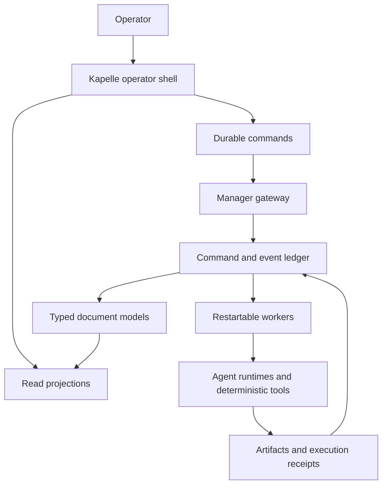

# Kapelle

Kapelle is an operator interface and operating layer for people who work with many AI agents across real projects.

Chat is useful for planning and directing work. It is much less effective for answering recurring operational questions:

- What is running now?
- What needs a human decision?
- What completed while I was away?
- Which outputs matter to me?
- What changed, who changed it, and why?
- Is the underlying system healthy?

Kapelle is an attempt to build the missing interface around those questions.

This repository is a public architecture and reference implementation. It contains no private fleet data, credentials, production configuration, or personal project content. It is not yet the production application source repository.

## Explore the repository

If you have ten minutes, follow this path:

1. Run `npm test` to verify the lifecycle and restart contracts.
2. Read [`fixtures/dispatch-lifecycle.json`](fixtures/dispatch-lifecycle.json) as the human-readable event history.
3. Read [`packages/document-models/src/dispatch-journal.js`](packages/document-models/src/dispatch-journal.js) to see how those events reduce into durable state.
4. Read [`apps/reference-control-plane/src/store.js`](apps/reference-control-plane/src/store.js) to see durable, idempotent command acceptance.
5. Use [`docs/architecture.md`](docs/architecture.md) for the intended production boundary.

| Area | What is here |
|---|---|
| [`packages/protocol`](packages/protocol/src/index.js) | Versioned command, dispatch, attempt, clarification, artifact, and receipt contracts |
| [`packages/document-models`](packages/document-models/src/index.js) | Executable Task and Dispatch Journal reducers |
| [`apps/reference-control-plane`](apps/reference-control-plane/src/server.js) | Runnable durable-command reference API using only Node.js |
| [`fixtures`](fixtures/dispatch-lifecycle.json) | A complete dispatch lifecycle that can be replayed through the reducer |
| [`tests`](tests/reference.test.js) | Contract, reducer, idempotency, clarification, and restart tests |
| [`docs`](docs/README.md) | Product and systems architecture documentation |

### Run the reference implementation

Requires Node.js 20 or newer. There are no third-party runtime dependencies.

```bash
npm test
npm run demo
npm run serve
```

Then submit a durable command:

```bash
curl -X POST http://127.0.0.1:4400/commands \
  -H 'content-type: application/json' \
  -H 'idempotency-key: architecture-demo-1' \
  -d '{"kind":"dispatch_agent","subject":"Prepare architecture briefing","agent_id":"agent:research"}'
```

The server commits the command before returning its stable ID. Repeating the request with the same idempotency key returns the original command rather than creating duplicate work.

## The product thesis

Most current agent products fit one of three shapes:

1. Agents disappear inside familiar applications.
2. One super-agent becomes the interface for everything.
3. Agents remain developer infrastructure.

Kapelle explores a fourth shape: people will use many specialized agents, closer to the way they use many applications today. If agents become a new software medium, people need an AI-native interface for operating them.

The analogy is the personal computer, not the company dashboard. Kapelle begins as an individual productivity system for one high-agency operator working across professional, civic, financial, household, and creative domains.

## What the operator sees

The core interface is intentionally small:

| Surface | Operator question |
|---|---|
| **My Desk** | Which reports and outputs should I read? |
| **Agent Activity** | What is in flight, queued, and recently completed? |
| **Needs Attention** | Which decisions, approvals, failures, or blockers require action? |
| **Tasks** | What does the human or fleet need to do next? |
| **System Health** | Is the control plane working, and what resources are being used? |

Everything else should earn its place by improving one of those answers.

## Architecture at a glance



The system is divided into three layers:

- **Agent substrate:** identities, runtimes, dispatch, attempts, clarification, and execution receipts.
- **Document substrate:** typed state, append-only operations, reducers, references, and projections.
- **Operator product:** prioritization, review, projects, tasks, loops, and human action.

The boundaries matter. The substrate records durable facts. Kapelle decides how those facts should be ranked, explained, and acted upon.

## Why document models

Agents are unreliable narrators. Typed documents with append-only operations are reliable evidence.

Kapelle uses a document-model direction inspired by reactive document architecture and event sourcing. A durable object contains:

- a typed state schema;
- a closed set of legal operations;
- a pure reducer from operations to current state;
- an append-only operation history;
- projections designed for specific operator views;
- explicit references to related documents.

This combines useful properties of files, databases, and user interfaces. Markdown remains valuable for reading and exchange, but it is not sufficient as the source of truth for lifecycle state.

## Why the manager must be durable

An agent system cannot depend on one process, one open HTTP request, or one in-memory waiter surviving.

The target control plane follows five rules:

1. Persist a durable command before execution.
2. Return a stable identifier immediately.
3. Run expensive or long-lived work in restartable workers.
4. Make retries idempotent and attempts traceable.
5. Treat completion, evidence, acceptance, and integration as separate facts.

Synchronous chat can remain a convenience. It cannot be the system of record.

## Relationship to ID Agents

Kapelle began as an operator layer built around [ID Agents](https://github.com/idchain-world/id-agents), a model-agnostic system for managing named agents and teams. The intended product boundary is complementary:

- ID Agents can provide a small, dependable orchestration substrate.
- Kapelle can provide the richer operator cockpit and document-centered workflows above it.

The most valuable upstream capabilities are stable APIs, durable asynchronous dispatch, explicit clarification and disposition states, verifiable runtime receipts, and portable team working directories. Kapelle should not require the upstream project to become a maximalist productivity application.

## Repository map

- [Product thesis](docs/product-thesis.md)
- [System architecture](docs/architecture.md)
- [Document models](docs/document-models.md)
- [Durable control plane](docs/control-plane.md)
- [Operator experience](docs/operator-experience.md)
- [ID Agents boundary](docs/id-agents-boundary.md)
- [Roadmap](docs/roadmap.md)
- [Example document contracts](examples/document-models/README.md)

## Current status

Kapelle is an active prototype. The operator UI, local fleet, document packages, and orchestration backend exist, but the system is still consolidating around a single public architecture and one coherent product surface.

This repository distinguishes three kinds of claims:

- **Current:** demonstrated in the working prototype.
- **In progress:** under active implementation or migration.
- **Proposed:** architectural direction that has not yet become product truth.

That distinction is intentional. Agent software needs more receipts and fewer demos that imply finished infrastructure.

## Principles

- Local-first by default.
- Human attention is the scarce resource.
- Operator outputs and system artifacts are different things.
- Every meaningful mutation should have an attributable operation history.
- Model routing should be explicit and verifiable.
- Deterministic software should perform deterministic work.
- Agents may propose; durable state decides what happened.
- A completed agent response is not the same as an integrated outcome.

## License

No license has been selected yet. The repository is public for architectural discussion and evaluation. All rights are reserved until a license is added.
