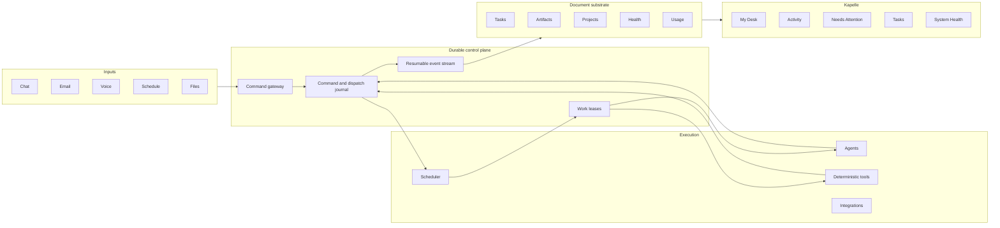

# System architecture

## Architectural goal

Kapelle should remain useful even when a model provider, agent process, browser, network connection, or manager process fails.

The architecture therefore separates durable truth from execution and presentation.

## Layer 1: agent substrate

The agent substrate owns execution facts:

- stable agent and team identities;
- runtime and model adapters;
- command acceptance;
- dispatch, attempt, lease, and retry lifecycle;
- structured clarification;
- cancellation, duplication, and supersession;
- runtime receipts and usage evidence;
- artifact references;
- completion and integration receipts.

It should be usable without Kapelle.

## Layer 2: document substrate

The document substrate owns durable operational state:

- typed documents;
- append-only operations;
- deterministic reducers;
- stable identifiers and explicit references;
- local storage and optional synchronization;
- read projections;
- migrations and package versions.

The document layer is not an agent framework. It provides the evidence and state that agents and interfaces consume.

## Layer 3: operator product

Kapelle owns interpretation and action:

- which artifacts belong on the operator's desk;
- which events require attention;
- how projects, tracks, and tasks are organized;
- how feedback becomes work;
- how recurring workflows are configured;
- how health and usage are explained;
- how personal and system artifacts remain distinct.

## Command and query separation

Writes enter as commands. Reads come from projections.

The UI should never need to scan repositories, transcripts, or directories to reconstruct current state. Expensive work happens asynchronously and materializes a bounded projection.

## Local-first does not mean single-process

The system can run on one machine while still containing independently restartable components:

- a small API gateway;
- a scheduler;
- worker processes;
- projection processors;
- an artifact ingester;
- an external watchdog.

Local-first describes ownership and availability of data. It does not require one large process or one shared failure domain.

## Trust boundary

The interface should distinguish:

- provider-reported facts;
- locally observed measurements;
- agent claims;
- operator decisions;
- inferred or estimated values.

An agent saying that work is complete is evidence. It is not, by itself, authoritative completion.
