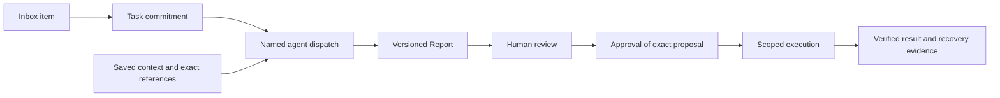

# Kapelle: a home base for your agents

**Conference briefing · October 5, 2026**

Website: [Kapelle.ai](https://kapelle.ai) · [Public reference code](../README.md#five-minute-verification)

## The problem

A useful agent system needs more than conversations. When work crosses agents, models, and restarts, the operator needs to know what was requested, what context was actually used, what came back, what was approved, and what changed outside the system.

Kapelle is building a local-first workspace for that loop. The user starts with an inbox item or task, gives a named agent specific instructions, reviews its output, and authorizes any consequential next step. Saved documents and verifiable records carry the context between runs.

## The workflow we are building

These are distinct records and states. Reading a report does not approve a deployment. An agent finishing its response does not prove an external action succeeded. Completing a task does not substitute for permission to publish.

## What is distinctive

- **Document-centered governance.** Typed operations, revisions, identities, and content hashes make authority inspectable. Enforcement occurs at command and execution boundaries, not merely in policy prose.
- **Context survives the model.** Instructions, source references, resolved-input receipts, and output identities are saved outside the conversation. The design aims to let another runtime resume with the same evidence.
- **Independent model and orchestration choices.** ID Agents supplies orchestration and communication boundaries; Kapelle supplies the work, review, and governance experience. Local inference has an explicit no-cloud-fallback reference boundary.
- **Honest recovery.** Lost acknowledgments, source changes, revoked access, and uncertain external effects remain distinguishable. Retry preserves operation identity rather than creating another action.
- **Human attention as a design constraint.** Routine inbox events should be filed by bounded rules; uncertain or consequential decisions should reach the person with context attached.

## What can be evaluated now

The public repository includes runnable Task/Dispatch reducers, lifecycle fixtures, durable command acceptance and restart tests, and a local-only inference boundary. Run `npm test` and `npm run demo` from the repository root.

The private prototype has Today, Inboxes, Tasks, Reports, People and Agents, with bounded review-agent workflows. Native References and Collections are implemented as a development candidate awaiting activation. General Task-origin delegation is next. See the [current status matrix](status.md).

## What is still being built

The next operator milestones are a complete knowledge-filing loop and one useful Task → approved agent work → linked Report journey. Voice intake, general URL/media retrieval, broader agent capabilities and interchangeable harnesses remain incomplete. The public repository is a runnable architecture reference, not a turnkey installation of the private application.

## Suggested discussion

How should an agent handoff carry portable authority and context? Which governance rules belong in reducers versus adapters? What evidence should a person see before approving an external effect? How can a system remain useful when some source records are unavailable?

Start with [agent governance and data structure](agent-governance.md), then inspect the executable reference packages. Public reference code and private native models are deliberately distinguished throughout.
