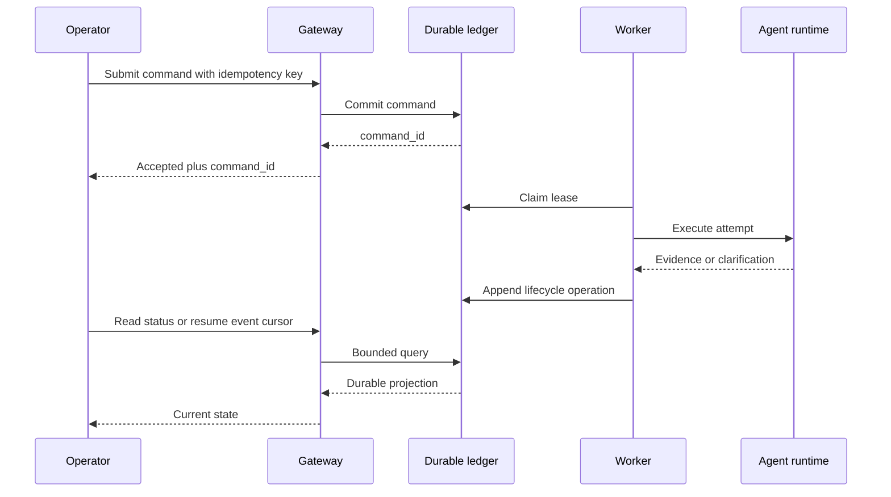

# Durable control plane

## Problem

Many agent managers are interactive applications pretending to be control planes. They hold a request open, wait for an agent, and return text. This works until the request times out, the manager restarts, the provider fails, or the agent needs input.

The control plane must treat those events as ordinary lifecycle transitions.

## Target flow

## Required invariants

### Durable acceptance

The command exists before execution begins. A caller disconnect cannot erase it.

### Stable identity

Retries create attempts under the same logical dispatch. They do not create unrelated work.

### Leased execution

Workers claim bounded leases with fencing tokens. An expired worker cannot continue writing as the current owner.

### Structured clarification

An agent needing human direction enters a durable state, releases execution capacity, and can resume exactly once from the answer.

### Explicit dispositions

Cancelled, declined, duplicate, superseded, partial, and failed are real states rather than prose inside a transcript.

### Evidence-backed completion

Execution completion, evidence availability, operator acceptance, and integration are separate transitions.

### Bounded reads

Health and status endpoints never perform unbounded scans or synchronous repository reconstruction.

## Component boundary

The gateway should only:

- validate and authenticate;
- persist commands;
- serve bounded projections;
- stream persisted events;
- expose liveness and readiness.

Scheduling, orchestration, artifact ingestion, verification, and projection building belong in restartable workers.

## Health

Health is multidimensional:

- process alive;
- HTTP responsive;
- datastore usable;
- scheduler progressing;
- workers fresh;
- leases reclaimable;
- projections current;
- deployed build identified.

A green process check must not hide a wedged control plane.

## Usage truth

Every execution attempt should record:

- requested runtime and model;
- actual runtime and model;
- fallback reason;
- provider-reported usage when available;
- locally measured latency and tool activity;
- whether values are exact, estimated, or unavailable.

Budget controls can then warn, defer, or stop new work without presenting invented precision.
