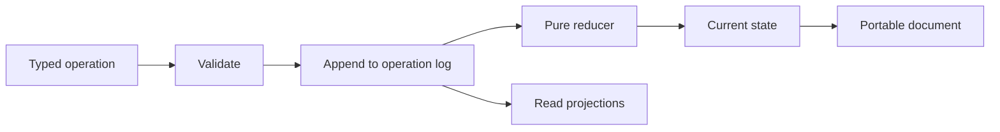

# Document models

## The abstraction

A document model is a typed, operation-sourced object.

It defines:

1. State: what the document contains now.
2. Operations: the legal ways it may change.
3. Reducer: how each operation produces the next state.
4. History: the ordered operations that created the state.
5. Projections: read models optimized for a particular use.



## Why this fits agent systems

Agent systems have characteristic failure modes:

- an agent describes a state that does not exist;
- two agents update the same work with different assumptions;
- a retry creates a duplicate side effect;
- the final file exists but nobody can explain how it changed;
- a status summary becomes stale while looking authoritative.

Typed operations turn those questions into inspectable facts.

## Example: task

A task document might accept operations such as:

- `CREATE_TASK`
- `ASSIGN_OWNER`
- `LINK_ARTIFACT`
- `MARK_BLOCKED`
- `RESOLVE_BLOCKER`
- `COMPLETE_TASK`
- `REOPEN_TASK`

Each operation includes a stable identity, timestamp, actor, expected revision, and typed input. The reducer rejects illegal transitions.

## Example: dispatch journal

A dispatch journal records execution lifecycle without pretending that every attempt succeeds:

```text
requested
  -> accepted
  -> leased
  -> running
  -> needs_clarification
  -> resumed
  -> execution_completed
  -> evidence_attached
  -> accepted
  -> integrated
```

Alternative terminal dispositions include cancelled, declined, duplicate, superseded, retryable failure, and terminal failure.

## Explicit references

Documents join through stable identifiers, never title similarity or prose proximity.

For example:

- a task links to its source artifact;
- an artifact links to the dispatch that produced it;
- a clarification links to the dispatch and attempt it suspended;
- an integration receipt links to the accepted artifact and promoted revision.

This makes context assembly deterministic and prevents agents from inventing relationships.

## Markdown and documents

Markdown remains an excellent representation for reading, writing, Git diffs, and model context. Kapelle treats it as an import, export, or projection format.

The source of truth for operational lifecycle should remain the typed document and its operations.

## Powerhouse direction

Kapelle's document architecture is influenced by Powerhouse and Reactive Document Architecture:

- event-sourced documents;
- command and query separation;
- local-first operation;
- document packages containing schemas, reducers, processors, and projections;
- portable document histories.

Kapelle does not need to reproduce the entire Powerhouse product. The useful boundary is to adopt compatible document principles and packages while preserving a Kapelle-native operator shell.
