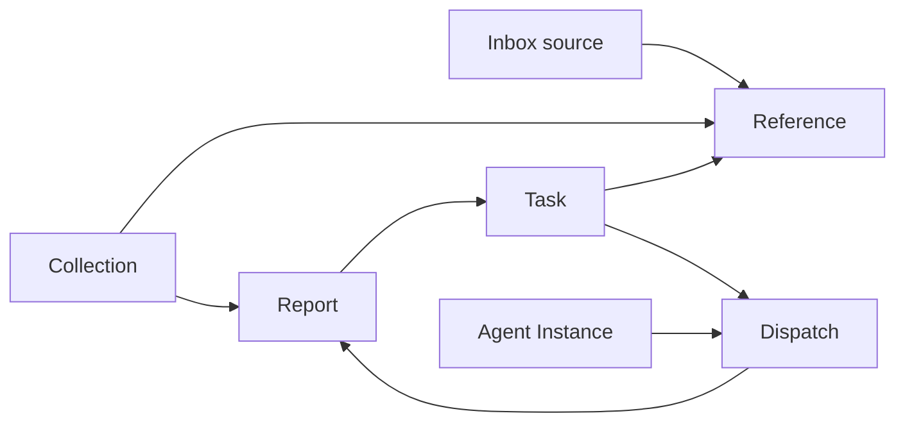
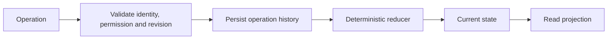

# Document models

A document model defines typed state, allowed operations, a deterministic reducer and operation history. Runtime admission adds identity, permissions and revision checks. Read projections make that state useful in the interface.

## The objects in Kapelle

| Object | Meaning | Important distinction |
|---|---|---|
| Task | A commitment with state and relationships | An agent result does not automatically complete it |
| Report | Authored output for reading and review, with publisher and content provenance | Reading, approval and external publication are separate |
| Reference | Retained source material or a link, with source provenance | A URL can be saved without fetching its contents |
| Collection | Named membership of References and Reports, associated with a project | Membership points to documents; it does not copy bodies or grant access |
| Agent Definition | Role, capabilities and policy description | Prose policy is not executable enforcement |
| Agent Instance | A particular agent identity using a definition | Identity is not proof the worker is online |
| Dispatch | An accepted unit of agent work and its execution/result relationships | A command acknowledgment is not completion |
| Review Intent | A decision bound to a particular proposal or output | Approval is not proof an external action occurred |

Tasks and Reports have separate private authorities. Native Reference/Collection support is a development candidate pending activation. This repository implements only simplified Task and Dispatch Journal reducers; the other objects in its walkthrough are explicitly illustrative records. See [status](status.md).

Arrows express relationships, not automatic execution or access grants. Projects organize documents; they are not a substitute for document identity.

## Reference, Collection or Report?

Save an interesting article as a Reference. Group it with related sources in a Collection. Write a synthesis as a Report, with links to its supporting sources. A Collection can contain that Report alongside the References. These documents can participate in shared task/delegation workflows without becoming the same document type.

For a Report, the relevant provenance includes who published it, what produced it, when it was produced, and which content version is being reviewed. Large content may be stored separately from lifecycle metadata; the identity/version relationship must remain verifiable. This repository does not prescribe or ship a production blob-store implementation.

## Operations and history

The public [Task reducer](../packages/document-models/src/task.js) accepts CREATE_TASK, ASSIGN_TASK, LINK_TASK_SOURCE, BLOCK_TASK, REOPEN_TASK and COMPLETE_TASK. These names describe this example, not the native API. The [Dispatch reducer](../packages/document-models/src/dispatch-journal.js) illustrates attempts, clarification, evidence, acceptance and integration.

Stable identifiers connect documents. Content versions identify the exact output reviewed. An editable title or an agent's narrative is not a reliable join key. Markdown is useful for content and export; it does not alone establish operational state.

## Powerhouse/Vetra

The private system uses native Powerhouse/Vetra models for agent and workflow records. Those packages carry schemas, operations, reducers and history. The public reducers demonstrate selected ideas without distributing the native packages or guaranteeing protocol compatibility. Some queues and recovery receipts remain service records; not every durable row is a native document.

Document models organize truth. Adapters and services still have to enforce access, execute effects, publish results and recover correctly. See [governance](agent-governance.md) and [contract limits](contracts.md).
