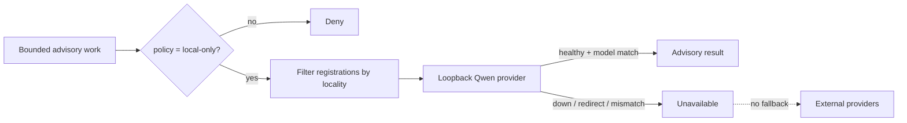

# Local AI boundary

## Why it exists

Kapelle coordinates frontier-model agents and a local model in the same operating system. The local path is for bounded advisory work where prompts may contain private personal, financial, health, or research context that should not be sent to an external model provider.

The demonstrated local model is:

```text
mlx-community/Qwen3.6-27B-4bit
```

It runs on Apple silicon behind an OpenAI-compatible loopback endpoint. The public code does not include private prompts, records, model weights, production configuration, or machine-specific paths.

## Contract

Callers submit a closed request:

```js
{
  policy: "local-only",
  purpose: "report-summarization",
  system: "Summarize the supplied report without adding facts.",
  prompt: "Synthetic report text",
  maxOutputTokens: 256
}
```

The public implementation in [`packages/local-inference`](../packages/local-inference/src/index.js) enforces the following properties before a request is sent:

1. `policy` must be exactly `local-only`.
2. `purpose` must be one of a small admitted set.
3. Unknown fields are rejected, so a caller cannot inject a provider, model, endpoint, header, or tool.
4. The endpoint must be explicit `127.0.0.1` or IPv6 loopback HTTP, include a port, and use exactly `/v1`.
5. Ambient HTTP proxy settings and local-model API keys are rejected.
6. The request contains no authorization header and redirects are disabled.
7. The returned model ID must match the configured model.
8. If no local provider succeeds, the gateway returns `unavailable`; it does not instantiate or fall back to an external provider.

## Provider-neutral, policy-specific

The interface is provider-neutral so that Kapelle does not couple workflows to one serving stack. The policy is not neutral: a `local-only` request may select only a provider registered with `locality: "local"`.

Filtering happens before provider construction. This is important because merely constructing a cloud client can read ambient credentials, discover proxy configuration, or initialize telemetry. External provider factories are never invoked on the local-only path.



## Admitted purposes

The reference package admits:

- report summarization;
- task extraction;
- project, tag, and due-date classification;
- concise correspondence drafting; and
- attention-triage classification.

These are advisory transformations. The model is not granted tools that mutate tasks, reports, files, correspondence, finance records, or source systems.

## What the tests prove

Run `npm test` and inspect [`tests/local-inference.test.js`](../tests/local-inference.test.js). The tests cover request-field closure, endpoint denial, proxy and credential denial, constructor-level exclusion of external providers, credential-free request shape, redirect refusal, exact model binding, and fail-closed behavior.

The suite is deterministic and uses a synthetic in-memory fetch stub. It does not need model weights or access to a private runtime.

## Demonstrated private deployment

The private Kapelle environment has exercised this adapter against `mlx-community/Qwen3.6-27B-4bit` on loopback. That demonstrates the integration path; it does not make the private deployment, prompts, or records part of this repository.

Frontier models remain useful for general agent work. The routing decision is explicit: a workflow chooses a policy and purpose, not a secret fallback chain.

## Limitations

- Loopback validation does not prove that the local serving process itself is trustworthy.
- This package does not provide operating-system sandboxing, weight verification, or a network firewall.
- It has no product route or default automatic workflow.
- It does not claim that all private workloads are suitable for this model.
- It does not publish or train on private records.

Those limits are intentional. The useful public artifact is the narrow boundary and its tests, not a claim that “local” automatically means secure.
