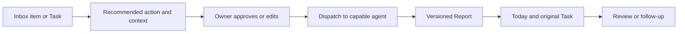

# Operator workflows

These examples explain the intended product using synthetic situations. Consult [status](status.md) for deployment maturity.

## Save knowledge without creating work

An operator sends: “Save this article for agent product ideas.”

1. Inbox retains the original message, URL, source identity and received time.
2. A recommendation selects a project and a named Collection.
3. Filing creates or links a Reference, records the disposition, and preserves the original.
4. The Collection points to that Reference. The operator can find it later without treating it as an unfinished task.

The native filing/Collection flow is a development candidate pending activation. A saved link does not imply successful page extraction, image analysis, or a summary. An agent can later organize or summarize the Collection through separately authorized work.

## Develop an evolving report

“Add this source to the agent product landscape.”

First retain the source as a Reference and optionally add it to a Collection. A Report is the authored synthesis: findings, recommendations, supporting sources, and publication provenance. Adding a source to a Collection can be deterministic. Revising the synthesis may require an agent and produces a new content version with source links.

A Collection can reference a Report or Reference without copying either body. Membership is organization, not permission to edit the member. Report, Reference and Collection should support consistent links to Tasks and agent work; uniform execution from every surface is a design goal, not a current public API.

## Delegate useful work

The target flow is:

The recommendation should reuse the original instructions. The operator should not need to restate an already clear request. It should name the agent doing the work, context it will receive, expected deliverable and where the result will return.

Bounded review pilots exist privately. General Task-origin delegation is the next slice. A reviewer that can produce text is not automatically capable of browsing a company website, updating a site, or changing a financial record. External actions need the appropriate adapter, scope and authorization.

## Routine inbox filing

Receipts, shipping notices and statement-available messages should be filed under explicit rules when no action is required. Exceptions must remain visible. Sender alone is insufficient to prove a message is routine; payment failures and suspicious renewal requests require different handling.

The review backlog is not a count of unfinished commitments. A repeated sweep must respect previous dispositions and source identities, rather than replaying old messages into new Tasks.

## What you can run here

`npm run walkthrough` traces connected synthetic records and replays the existing Task/Dispatch reducers. It does not contact a model, read a real inbox, fetch a URL or publish a Report. [Try it](../examples/document-models/README.md).
